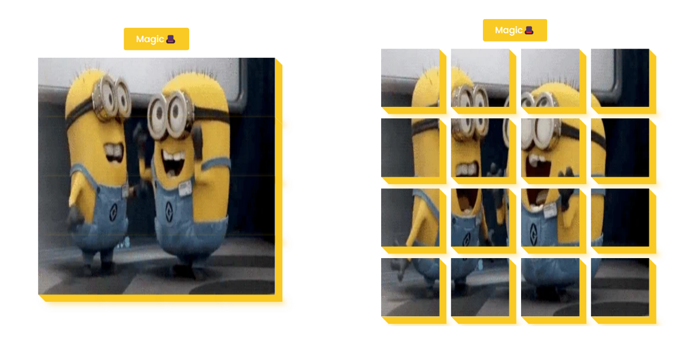

# 3D Box

## Table of Contents

- [Links](#links)
- [Description](#description)
- [Screenshot](#screenshot)
- [Demo](#demo)
- [Features](#features)
- [Technologies Used](#technologies-used)
- [Usage](#usage)
- [What I Learned](#what-i-learned)
- [Contributing](#contributing)

## Links

- Solution URL: [GitHub Repository](https://github.com/aruntutter/3d-box)
- Live Demo: [Live Demo URL](https://aruntutter.github.io/3d-box/)

## Description

The 3D Box project is a simple web application that showcases a 3D box made of multiple smaller boxes. Clicking the "magic🎩" button toggles a transformation that rotates the box.

## Screenshot

## Demo

You can see a live demo of the 3D Box project [here](https://sprightly-dieffenbachia-057c35.netlify.app).

## Features

- Clicking the "magic🎩" button rotates the 3D box.
- The box is constructed using smaller boxes, creating a 3D effect.
- Responsive design to adapt to different screen sizes.

## Technologies Used

- HTML
- CSS
- FlexBox
- JavaScript

## Usage

- Open the index.html file in your preferred web browser.
- Click the "magic🎩" button to see the box rotate.

## What I Learned

Implementing a 3D effect using multiple smaller boxes.
Toggling CSS classes to apply transformations.
Working with event listeners to handle button clicks.

## Contributing

Contributions are welcome! If you find any issues or have suggestions for improvements, please submit a pull request. Bug reports and feature requests are also appreciated.
